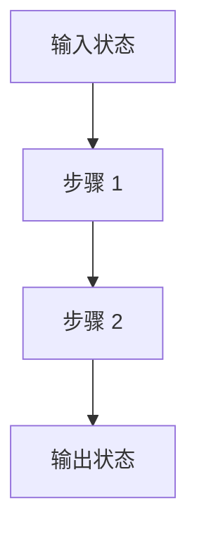

# Mx：章节标题

> 状态：`draft` / `verified`
> 对应任务：`TASK-Mx-...`
> 代码基线：提交或会话 ID

## 本章目标

读完后，读者应该能够：

- 用自己的话说明本阶段解决的问题。
- 画出关键控制流和数据布局。
- 在当前代码中定位关键实现。
- 运行实验并解释成功/失败输出。

## 1. 背景：为什么需要这一阶段

先解释问题和前置知识。首次出现缩写时给出全称，避免把寄存器名、协议名和
数据结构当作读者已经掌握的知识。

## 2. 进入本阶段时机器是什么状态

列出 CPU mode、关键寄存器、内存、栈、设备和上一阶段交接不变量。

## 3. 总体设计

解释为什么采用此设计，以及没有采用的主要替代方案。

## 4. 实现方法

按执行顺序拆分小节。每节至少包含：输入、不变量、关键操作、输出和错误处理。
引用仓库内文件与符号，不大段复制源代码。

## 5. 关键数据布局

使用表格或等宽图明确地址、大小、对齐、所有者和生命周期。

## 6. 如何验证

提供可以复制执行的命令、期望输出、失败意味着什么，以及至少一个负路径或边界
实验。无法自动化的验证明确标记 `NOT_RUN`。

## 7. 常见误解与排错

列出概念混淆、常见故障、最先检查的位置和可观察信号。

## 8. 当前限制与下一阶段

区分教学取舍、尚未实现的功能和真实缺陷；说明下一里程碑如何接管临时机制。

## 9. 练习

提供阅读代码、修改实验和思考题，但不要让练习破坏默认构建。

## 10. 拓展阅读

### 基础原理

- 标准或官方手册：说明建议阅读的章节。

### 当前主流实现

- 上游官方文档/源码：说明它与本项目的差异。

### 项目内延伸

- ADR、参考文档和下一章节。

## 完成检查

- [ ] 背景、输入状态、实现、验证、限制均已覆盖。
- [ ] 至少一张流程图和一张精确布局图/表。
- [ ] 图、常量、文件路径与当前代码一致。
- [ ] 正常路径与关键失败路径有证据。
- [ ] 拓展阅读链接已核对，并标注用途。
- [ ] `TASKS.md`、`PROJECT_STATUS.md` 和会话日志已同步。
