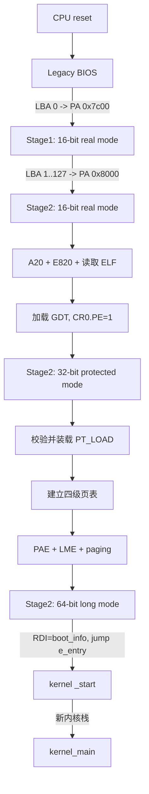
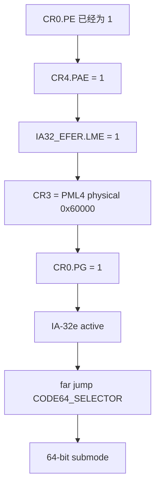

# 从按下电源到 `kernel_main`：x86_64 内核启动深度讲解

> 状态：`verified`
> 对应实现：M0-M2
> 阅读对象：知道一点 C，但不要求预先理解 GDT、页表或 CPU mode

这篇文章只讲一件事：当前项目如何把一台刚由 Legacy BIOS 接管的 x86 电脑，
一步步变成能够执行 64 位 higher-half C 内核的机器。

## 先回答三个核心问题

### M2 只是构建页表吗？

不是。页表只是 M2 的一个环节。M2 实际承担的是“执行环境转换器”：

| 工作 | 解决的问题 |
|---|---|
| 启用 A20 | 允许访问 1 MiB 以上物理内存 |
| 获取 BIOS E820 | 知道哪些物理内存可用、哪些必须保留 |
| 读取 kernel ELF | 把磁盘上的内核文件放进暂存区 |
| 解析 ELF program headers | 知道哪些 bytes 应装到哪些物理地址 |
| 建立 GDT | 给 protected/long mode 提供代码和数据描述符 |
| 进入 32-bit protected mode | 获得平坦、方便的 32 位执行环境 |
| 校验并复制 `PT_LOAD` | 真正把内核代码、数据放入 RAM，清零 BSS |
| 建立四级页表 | 把 higher-half 虚拟地址连接到低物理地址 |
| 开启 PAE/LME/paging | 激活 x86-64 long mode |
| 构造 `boot_info` | 把内存图、磁盘号、内核范围交给内核 |
| 跳转 ELF `e_entry` | 从 bootloader 正式进入内核 `_start` |

### Selector 为什么是 `0x08、0x10、0x18、0x20`？

它们不是 8、16、24、32 位，也不是“bit 不断增加”。它们是 GDT 表项的 selector。
每个 GDT descriptor 恰好 8 bytes，selector 的高 13 位保存表项索引，因此相邻
表项在数值上相差 `1 << 3 = 8`。

### 为什么启动过程不是从头到尾统一 64 位？

因为 Legacy BIOS 是历史兼容路径。x86 CPU/固件先提供 real-mode 风格环境；我们的
Stage1 也必须在这个环境里调用 BIOS。等固件信息和磁盘读取完成后，Stage2 才能
建立 GDT、页表并主动进入 long mode。

`16 → 32 → 64` 是当前 x86 Legacy BIOS 路径，不是所有 CPU 架构的统一规律。

---

## 1. 先建立三个坐标系

启动代码最容易读混，是因为同一个对象同时有三种“位置”。

### 1.1 磁盘位置

表示某些 bytes 在硬盘镜像哪里，用 byte offset 或 LBA sector 表示：

```text
LBA 0       Stage1
LBA 1..127  Stage2 区域
LBA 128...  kernel.elf
```

它不能直接被 CPU 执行，必须由 BIOS/loader 读取到 RAM。

### 1.2 物理地址

表示 RAM 或设备总线上的真实位置：

```text
Stage1              PA 0x00007c00
Stage2              PA 0x00008000
ELF staging         PA 0x00020000
临时页表            PA 0x00060000
kernel PT_LOAD      PA 0x00100000...
```

### 1.3 虚拟地址

开启 paging 后，CPU 指令使用虚拟地址，由页表翻译到物理地址：

```text
VA 0xffffffff80000000 -> PA 0x00100000
```

所以 `kernel.elf 在 LBA 128`、`内核装到物理 1 MiB`、`内核从高虚拟地址运行`
三句话并不冲突，它们分别属于磁盘、物理和虚拟坐标系。

---

## 2. 再区分“位数”“模式”和“权限”

这些概念经常一起出现，但不是一回事。

| 概念 | 例子 | 它决定什么 |
|---|---|---|
| 指令/执行模式 | real、protected、long | CPU 如何解释指令和地址 |
| 操作数/地址宽度 | 16、32、64 bit | 一条指令处理多少位、如何编码 |
| 特权级 | Ring 0..3 | 是否能执行特权指令、访问受保护资源 |
| Selector | `0x08`、`0x18` | 选择 GDT/LDT 中哪个 descriptor |
| 页表权限 | P/RW/US/NX | 某虚拟页是否存在、可写、用户可访问、可执行 |

`.code16`、`.code32`、`.code64` 是给 assembler 的编码指示，不能单独切换 CPU。
真正切换模式要修改控制寄存器、加载 GDT/页表并执行控制流转移。

---

## 3. 全景图：当前项目的完整启动链



每个箭头都在建立下一阶段依赖的不变量。启动不是“跳到内核地址”这么简单，而是
不断回答三个问题：下一条指令在哪里？CPU 应怎样解释它？它访问的地址如何翻译？

---

## 4. Phase 0：BIOS 把 Stage1 放到 `0x7c00`

CPU 复位后先执行固件。Legacy BIOS 初始化基础平台、选择启动磁盘，读取第一个
512-byte sector，并检查末尾 boot signature `55 AA`。

成功时 BIOS：

- 把 sector 放到物理 `0x7c00`。
- 跳转到那里执行。
- 用 `DL` 告诉代码从哪个 BIOS drive 启动。

BIOS 不认识我们的 ELF、C 函数或目录结构。它只完成最小交接。

---

## 5. Phase 1：Stage1 建立可信的 16 位环境

实现见 [boot/stage1.S](../../boot/stage1.S) 的 `stage1_start`。

### 5.1 为什么先规范化 `CS:IP`

real mode 物理地址公式是：

```text
physical = segment × 16 + offset
```

所以 BIOS 可以用不同组合进入同一个物理地址：

```text
0000:7c00 -> 0x7c00
07c0:0000 -> 0x7c00
```

Stage1 用 far jump 统一为项目预期的 `CS:IP` 表示。这里 `CS` 是代码段，`IP`
是下一条指令在段内的 offset。

### 5.2 为什么初始化 `DS/ES/SS:SP`

```text
DS  数据访问默认使用的 segment
ES  某些字符串指令和 BIOS buffer 使用的额外 segment
SS  stack segment
SP  stack pointer
```

把 `DS=ES=SS=0`、`SP=0x7c00` 不是简单的“变量清零”，而是在建立地址解释规则
和确定的栈。`call` 会把返回地址压栈；栈未知时，第一次函数调用就可能破坏代码。

更新 `SS:SP` 前用 `CLI` 暂时屏蔽可屏蔽中断，避免 CPU 在栈只更新一半时进中断。
`CLD` 则保证 `LODS/MOVS/STOS` 等字符串指令向高地址前进。

### 5.3 为什么必须保存 `DL`

后面的 INT 13h 磁盘调用仍需 drive number。普通运算可能覆盖 `DL`，因此立即保存：

```text
BIOS DL -> boot_drive byte -> 每次 INT 13h 前恢复 DL
```

### 5.4 Stage1 如何找到 Stage2

Stage1 先用 INT 13h `AH=41h` 检查扩展接口，再用 `AH=42h` 和 DAP 读取：

```text
磁盘 LBA 1..127 -> 0800:0000 -> PA 0x8000
```

失败会 reset disk 并重试三次。读完后检查内存开头是否为 `S2OK`，成功才 far
jump 到 `0800:0004`。`0x8004` 是 magic 后的第一条 Stage2 指令。

此时串口标记为：

```text
S1   已进入 Stage1
E1   磁盘接口/读取失败
E2   Stage2 magic 无效
```

---

## 6. Phase 2：Stage2 仍在 16 位，因为还要调用 BIOS

Stage2 入口位于 [boot/stage2.S](../../boot/stage2.S) 的 `stage2_entry`。

### 6.1 为什么不立刻进入 64 位

当前实现还要通过 BIOS INT 15h 获取 E820、通过 INT 13h 读取 kernel ELF。这些
接口按 real-mode BIOS 调用约定工作。进入 protected/long mode 后，不能继续直接
依赖这些 BIOS interrupts。

所以顺序必须是：

```text
先完成 BIOS 服务调用
    ↓
再离开 real mode
    ↓
进入内核后不再回来
```

### 6.2 A20 解决什么问题

历史兼容可能让 1 MiB 以上地址回绕到低地址。内核要装到 `0x100000` 以上，所以
Stage2 通过 port `0x92` 打开 A20 gate。

### 6.3 E820 解决什么问题

RAM 中并非所有地址都可使用。E820 返回一组：

```text
base + length + type + attributes
```

`type=1` 才表示普通可用 RAM。项目把最多 64 条记录放在 `0x18100`，以后通过
`boot_info` 交给内核。

### 6.4 为什么先把整个 ELF 读入 staging

kernel ELF 位于 LBA 128。Stage2 按构建时计算的 sectors，把它分批读到
`0x20000..0x5ffff`。此时只是把文件复制进 RAM，还没有把内核装到最终位置。

---

## 7. GDT 是什么：给 segment selector 提供说明书

Global Descriptor Table（GDT）可以想象成 CPU 使用的一张固定格式表。每个表项
是一个 8-byte descriptor，描述代码段或数据段的类型、权限、默认宽度等属性。

当前表位于 `gdt_start`：

| GDT index | Selector | 当前用途 |
|---:|---:|---|
| 0 | `0x00` | null descriptor，必须保留 |
| 1 | `0x08` | Ring 0，32-bit code |
| 2 | `0x10` | Ring 0，32-bit data |
| 3 | `0x18` | Ring 0，64-bit code |
| 4 | `0x20` | Ring 0，64-bit data/stack selector |

### 7.1 Selector 的 16-bit 格式

```text
15                              3  2  1      0
+--------------------------------+--+---------+
|          descriptor index      |TI|   RPL   |
+--------------------------------+--+---------+

TI  = 0 选择 GDT，1 选择 LDT
RPL = Requested Privilege Level，0..3
```

因此 selector 的计算近似是：

```text
selector = (index << 3) | TI | RPL
```

当前都选 GDT、RPL 0，所以：

```text
index 1 -> 1 << 3 = 0x08
index 2 -> 2 << 3 = 0x10
index 3 -> 3 << 3 = 0x18
index 4 -> 4 << 3 = 0x20
```

这就是为什么数值每次增加 8。不是位数在增加，而是 index 增加 1 后左移 3 位。

如果 index 1 请求 Ring 3，则低两位为 3，selector 会是 `0x0b`，仍然选择同一个
descriptor，但请求的特权级不同。

### 7.2 CPU 如何从 selector 找到 descriptor

`LGDT` 加载的是一个 `{limit, base}`：

```text
GDTR.base  -> GDT 起始地址
GDTR.limit -> GDT 最后一个有效 byte 的 offset
```

随后 CPU 计算：

```text
descriptor_address = GDTR.base + selector.index × 8
```

Selector 本身不是 descriptor 地址，也不是内存地址。

### 7.3 Descriptor 里有什么

一个传统 x86 segment descriptor 的字段被分散编码，核心含义包括：

```text
base/limit   segment 基址和范围
type         code/data、可读写等
S            system 还是普通 code/data
DPL          descriptor privilege level
P            present
L            64-bit code 标志
D/B          32-bit 默认操作数/栈宽度
G            limit 是否以 4 KiB 为单位
```

当前 32-bit code/data descriptor 使用 base 0 的平坦模型；32-bit code 设置默认
32-bit 属性。64-bit code descriptor 设置 `L=1`、`D=0`。在 64-bit mode 中，
`DS/ES/SS` 的 base/limit 基本不再参与普通地址计算，但 selector 的有效性和权限
仍有意义；`FS/GS` base 则仍常用于 per-CPU 或线程数据。

### 7.4 为什么 code 和 data 要分开

Descriptor 的 type/权限不同：代码段要允许 execute/read，数据段要允许
read/write。把它们分开使 CPU 能检查“这是不是可执行代码段”。

### 7.5 为什么还要分 32-bit code 和 64-bit code

因为进入 protected mode 后我们先执行 32-bit loader；开启 IA-32e paging 后，又要
通过 `CS` 中 descriptor 的 `L` 属性选择 64-bit submode。

在 long mode 激活后，如果 `CS.L=0`，CPU 还可能处于 compatibility submode，执行
32-bit 风格代码；只有加载 `L=1` 的 64-bit code descriptor，才真正执行 64-bit
指令。因此 GDT selector 与“CPU 现在怎样解释代码”有关，但 selector 的数字本身
不表示位数。

---

## 8. Phase 3：从 Real Mode 进入 32-bit Protected Mode

Stage2 执行：

```text
CLI
LGDT gdt_descriptor
CR0.PE = 1
far jump CODE32_SELECTOR:protected_mode_entry
```

为什么设置 `CR0.PE` 后还要 far jump？因为 `CS` 有 CPU 内部缓存，必须通过 far
control transfer 加载新的 selector，并让后续指令按新的 code descriptor 解释。

进入 `protected_mode_entry` 后：

- `DS/ES/SS/FS/GS = DATA32_SELECTOR`。
- `ESP = 0x8f000`，换成 32-bit transition stack。
- 不再调用 BIOS。
- 开始检查 long-mode CPU capability、ELF 和内存范围。

---

## 9. ELF Loader：从“文件”得到“可执行内存布局”

ELF 有两个常被混淆的视图：

```text
Sections         给 linker/debugger 看：.text/.rodata/.data/.bss
Program headers  给 runtime loader 看：PT_LOAD segments
```

Stage2 检查 ELF64、x86-64、ET_EXEC、header 边界、segment 范围、higher-half VMA
和 executable entry，然后逐个处理 `PT_LOAD`：

```text
staging + p_offset --复制 p_filesz--> p_paddr
                                      |
                                      `--清零 p_memsz-p_filesz（BSS）
```

为什么不能把整个 ELF 平铺到 `0x100000`？因为 ELF header、debug sections、section
table 等不等于运行时内存，且 BSS 在文件中不需要存成一大片零。

Loader 还要求 E820 type 1 区域覆盖全部 kernel physical range，否则拒绝覆盖未知
或保留内存。

---

## 10. 页表：把高虚拟地址连接到低物理 RAM

内核由 linker 链接为：

```text
VMA 0xffffffff80000000
LMA/PA 0x00100000
```

如果没有页表，CPU 不知道这两个地址属于同一份代码。Stage2 在
`0x60000..0x84fff` 建立临时四级页表。

### 10.1 低 1 GiB identity map

```text
VA 0x00000000..0x3fffffff -> 相同 PA
```

用途是保证开启 paging 瞬间，当前 Stage2、页表、boot info 和 transition stack
仍可用。这里使用 512 个 2 MiB huge pages。

### 10.2 Higher-half map

```text
VA 0xffffffff80000000..0xffffffff83ffffff
 -> PA 0x00100000..0x040fffff
```

它使用 32 张 PT、16384 个 4 KiB PTE，共覆盖 64 MiB。

```text
PML4[511]
  -> PDPT[510]
       -> PD[0..31]
            -> 32 张 PT
                 -> 4 KiB physical frames
```

以入口为例：

```text
VA 0xffffffff80000000
  PML4 index 511
  PDPT index 510
  PD index   0
  PT index   0
  offset     0
       ↓
PA 0x00100000
```

当前临时页表统一设置 Present + Writable，尚未按 ELF R/W/X flags 收紧权限；这是
M4 最终页表要接管的工作。

---

## 11. Phase 4：真正开启 Long Mode

顺序非常重要：



控制位含义：

| 位 | 含义 |
|---|---|
| `CR4.PAE` | 允许 PAE/IA-32e 页表格式 |
| `EFER.LME` | 请求启用 long mode |
| `CR3` | 当前顶级页表的物理地址 |
| `CR0.PG` | 开启 paging；满足条件时激活 IA-32e |
| `CS.L` | 选择 64-bit code submode |

设置 `CR0.PG` 后，地址翻译立即生效。identity map 保证当前低地址代码不断路；far
jump 到 `CODE64_SELECTOR` 则让 CPU 开始按 64-bit 指令模式执行 `long_mode_entry`。

---

## 12. Phase 5：64-bit Stage2 如何把参数交给内核

`long_mode_entry` 做的事很少但关键：

```text
加载 64-bit data selectors
RSP = 0x8f000
RBP = 0
RDI = 0x18000（boot_info）
RAX = boot_info.kernel_entry（ELF e_entry）
jmp *RAX
```

为什么参数放 `RDI`？当前项目遵循 SysV AMD64 风格调用约定，第一个整数/指针参数
使用 `RDI`。这是一份 loader/kernel ABI，不是 CPU 自动规定的 boot info 格式。

`boot_info v1` 包含：

- 版本和结构大小。
- BIOS boot drive。
- E820 pointer/count。
- kernel physical/virtual start/end。
- ELF entry。

---

## 13. Phase 6：`_start` 为什么还要换一次栈

内核入口见 [kernel/arch/x86_64/entry.S](../../kernel/arch/x86_64/entry.S)：

```text
CLI
RSP = bootstrap_stack_top
RBP = 0
call kernel_main
```

Stage2 的 `0x8f000` 只是 loader transition stack。内核不能长期依赖 bootloader
拥有的临时内存，所以 `_start` 立即使用链接进 `.bss.stack` 的 16 KiB bootstrap
stack。这个栈也位于 higher-half 映射中。

随后 `call kernel_main` 时，`RDI` 仍保留 boot info pointer，C 函数签名是：

```c
void kernel_main(const struct boot_info *info);
```

`kernel_main` 初始化 COM1、校验 boot info、打印内核范围和 E820，最后输出
`K2:HALT`。到这里才算完成 M2 的“进入 C 内核”目标。

---

## 14. 三次换栈、三种地址环境总结

### 栈的生命周期

```text
Stage1/Stage2 real mode   SS:SP = 0000:7c00
Stage2 protected/long    ESP/RSP = 0x0008f000
Kernel _start            RSP = higher-half bootstrap_stack_top
```

### CPU 状态表

| 阶段 | Mode | Paging | 地址模型 | BIOS 可直接调用 |
|---|---|---|---|---|
| BIOS -> Stage1 | 16-bit real | off | segment:offset | 是 |
| Stage2 early | 16-bit real | off | segment:offset | 是 |
| Stage2 loader | 32-bit protected | off | flat linear≈physical | 否 |
| Stage2 long entry | 64-bit long | on | virtual -> page tables -> physical | 否 |
| Kernel C | 64-bit long | on | higher-half + temporary identity | 否 |

---

## 15. 为什么不同架构的启动过程不同

所有内核都需要解决相似问题：取得硬件描述、找到 RAM、装载 image、建立异常/内存
环境、传参并跳入内核。但寄存器和转换路径由 ISA 与 firmware contract 决定。

| 平台/路径 | 典型入口状态 | 内存转换机制 | 参数交接 | GDT selector |
|---|---|---|---|---|
| x86 Legacy BIOS（本项目） | real mode 风格入口 | CR3 + 四/五级页表 | 自定义 boot info | 需要，x86 特有 |
| x86-64 UEFI | firmware 已在 64-bit 环境 | firmware map，之后内核自建页表 | EFI system/config tables | firmware/内核仍有 GDT，但不走本项目 16-bit Stage1 |
| AArch64 | 通常 non-secure EL2 或 EL1，MMU off | TTBR/TCR/translation tables | `x0 = DTB` 等 | 没有 GDT |
| RISC-V | firmware/OpenSBI 后进入 S-mode，`satp=0` | `satp` 指向 Sv39/Sv48 等页表 | `a0=hartid, a1=DTB` | 没有 GDT |

所以 GDT、selector、`CR0/CR4/EFER` 是 x86 的具体机制，不应机械套到 ARM 或
RISC-V。AArch64 的 Exception Level、RISC-V 的 M/S/U mode 也不能简单等同于
x86 的 16/32/64 位；一个描述权限层级，另一个还涉及执行/地址模式。

即使同为 x86，UEFI 与 Legacy BIOS 路径也不同。UEFI bootloader 可在固件提供的
64-bit 环境中运行，不需要我们的 512-byte real-mode Stage1；但退出 firmware
services、保存 memory map、建立内核自己的页表和传递参数仍然存在。

---

## 16. 如何用串口输出定位启动阶段

```text
S1                  BIOS 已跳入 Stage1
S2                  Stage1 已加载并交接 Stage2
M2:E820 OK          real-mode BIOS 内存图完成
M2:ELF OK           protected-mode ELF 装载与页表准备完成
K2:LONG MODE OK     已进入 64-bit higher-half C 内核
K2:BOOT / K2:E820   boot_info 传递正确
K2:HALT             M2 验收终点
```

如果输出停止：

| 最后标记 | 优先检查 |
|---|---|
| 没有 `S1` | BIOS image、boot signature、QEMU drive |
| `S1` | INT 13h、Stage2 LBA/DAP、`S2OK` |
| `S2` | A20、E820、kernel disk read |
| `M2:E820 OK` | ELF magic/program headers、磁盘 payload |
| `M2:ELF OK` | CR4/EFER/CR3/CR0、GDT 64-bit descriptor、页表 |
| `K2:LONG MODE OK` | boot info ABI、pointer/count、kernel stack |

运行完整验证：

```sh
make image
make verify
make test-boot
```

`make test-boot` 分别等待正常、损坏 Stage2、非法 ELF、低内存场景的终止标记，
看到标记后主动回收 QEMU。

---

## 17. 最常见的概念误区

### “`0x18` 是 24 位 selector”

错误。`0x18 = index 3 << 3`，它选择 GDT 第 3 项；该 descriptor 的 `L` 等字段
才描述 64-bit code 属性。

### “`LGDT` 以后马上就是 32 位”

错误。`LGDT` 只告诉 CPU 表在哪里；还要设置 `CR0.PE` 并 far jump 加载新的 `CS`。

### “`.code64` 会让 CPU 进入 64 位”

错误。它只影响 assembler 编码。CPU mode 由控制寄存器、EFER、paging 和 `CS`
descriptor 共同决定。

### “建立页表就是已经开启分页”

错误。写内存只是准备数据结构；还要把 PML4 physical address 写入 `CR3` 并设置
`CR0.PG`。

### “内核入口的 higher-half 地址就是 RAM 地址”

错误。它是虚拟地址，通过页表映射到物理 1 MiB。

### “进入 `kernel_main` 后 bootloader 已经没有影响”

当前仍在使用 Stage2 建立的页表和 identity-mapped boot info。M4 建立最终页表前，
内核不能随意删除这些映射。

---

## 18. 建议的阅读与实验顺序

1. 先读 [boot/stage1.S](../../boot/stage1.S) 的前 86 行，只追踪寄存器和错误标记。
2. 在 [boot/stage2.S](../../boot/stage2.S) 中依次找 `stage2_entry`、
   `protected_mode_entry`、`build_page_tables`、`long_mode_entry`。
3. 用 `readelf -hW/-lW` 对照 ELF header 和 `PT_LOAD`。
4. 手算 selector `0x18` 的 index/TI/RPL。
5. 手算 `0xffffffff80000000` 的四级页表 indices。
6. 最后读 [entry.S](../../kernel/arch/x86_64/entry.S) 和
   [kernel/main.c](../../kernel/main.c)，观察 ABI 如何进入 C。

可以回答下面问题时，说明主线已经掌握：

- 为什么 BIOS drive 必须保存？
- 为什么 E820 必须在 real mode 阶段获取？
- 为什么 `CR0.PE` 后需要 far jump？
- 为什么 selector 相邻值差 8？
- 为什么 `CR0.PG` 前必须先准备 identity map？
- 为什么 `_start` 还要重设 `RSP`？

---

## 19. 拓展阅读

### x86 基础与当前实现

- [Intel 64 and IA-32 Software Developer Manuals](https://www.intel.com/content/www/us/en/developer/articles/technical/intel-sdm.html)：Volume 3A 重点阅读 protected mode、segment descriptor、IA-32e mode 与 paging。
- [Linux/x86 Boot Protocol](https://docs.kernel.org/arch/x86/boot.html)：比较成熟 Linux 的 16/32/64-bit boot contracts 与 `boot_params`。
- [Linux Page Tables](https://docs.kernel.org/mm/page_tables.html)：从现代 Linux 角度理解 MMU、TLB、page walk 和 page fault。
- [UEFI Specifications](https://uefi.org/specifications)：比较 Legacy BIOS 与 UEFI 2.11 的 image、memory map 和 Boot Services。

### 跨架构对比

- [Linux：Booting AArch64](https://docs.kernel.org/arch/arm64/booting.html)：查看 EL1/EL2、MMU off、`x0=DTB` 等入口契约。
- [Arm Exception Model](https://developer.arm.com/-/media/Arm%20Developer%20Community/PDF/Learn%20the%20Architecture/Exception%20model.pdf)：理解 AArch64 Exception Levels，不要与 x86 位数混淆。
- [Linux：RISC-V Kernel Boot Requirements](https://docs.kernel.org/arch/riscv/boot.html)：查看 `a0/a1`、`satp=0` 和临时映射。
- [RISC-V Privileged Architecture](https://docs.riscv.org/reference/isa/_attachments/riscv-privileged.pdf)：理解 M/S/U privilege modes 与 `satp`。

### 项目内继续阅读

- [M1：BIOS 如何找到 Stage2](m1-bios-stage1.md)
- [M2：从 ELF Loader 到 Long Mode](m2-loader-long-mode.md)
- [ADR-0005：M2 内存布局与 boot info](../decisions/0005-m2-loader-memory-and-boot-info.md)
- [启动参考](../boot.md)
