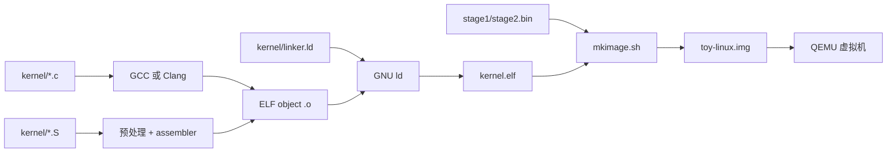

# M0：从源代码到内核镜像

> 状态：`verified`
> 对应任务：`TASK-M0-001`
> 实现会话：`20260731-1506-m0-build-foundation`

## 本章目标

读完后，你应该能解释普通应用和内核构建的差别，区分编译、链接、ELF 和磁盘
镜像，理解 VMA/LMA，并能用项目命令验证构建结果。

## 1. 背景：内核为什么不能像普通 C 程序一样编译

普通程序启动时，操作系统已经准备好了进程地址空间、栈、动态链接器和 libc，
最终调用 `main()`。内核恰好负责提供这些能力，因此不能假设它们已经存在。

这种环境称为 **freestanding environment**：入口可以不是 `main`，标准库可能
不存在，程序必须自行安排启动、内存布局和运行时支持。

```text
普通应用                              本项目内核
OS 创建进程                           BIOS/loader 只交出 CPU
动态链接器装载依赖                    没有动态链接器
libc 提供 memcpy/printf/...           需要内核自己实现
运行时调用 main                       汇编入口 _start
OS 决定虚拟地址空间                   linker + 页表共同决定
```

因此，M0 的成果不是“内核功能”，而是一条可信的生产线：相同输入能够稳定产生
结构正确、地址明确、可检查的 ELF 和磁盘镜像。

## 2. 从源码到启动镜像



这里有三个容易混淆的产物：

- `.o`：尚未完成地址安排的目标文件，可能仍有待解析符号。
- `kernel.elf`：包含入口、segments、symbols 和调试信息的可执行文件。
- `toy-linux.img`：模拟硬盘的原始字节序列，BIOS 只能从它读取扇区。

## 3. 编译约束如何表达

[Makefile](../../Makefile) 对内核使用以下关键参数：

| 参数 | 原因 |
|---|---|
| `-ffreestanding` | 不假定 hosted C 环境 |
| `-fno-stack-protector` | 早期没有 stack protector runtime |
| `-fno-pic -fno-pie` | 地址由内核布局控制 |
| `-m64` | 生成 x86-64 代码 |
| `-mcmodel=kernel` | 允许代码位于负 2 GiB 的 higher half |
| `-mno-red-zone` | 中断可能使用当前内核栈下方区域 |
| `-mno-mmx -mno-sse -mno-sse2` | 初始化扩展状态前不使用这些寄存器 |
| `-Wall -Wextra -Werror` | 尽早把可疑代码变成构建失败 |

项目允许 `CC=gcc` 或 `CC=clang`，但最终 ELF 和 raw binary 都由 GNU `ld`
链接。两种编译器都通过实际构建和 QEMU 启动测试。

## 4. 链接脚本：VMA 和 LMA

内核希望在高地址运行，但启动时必须占用真实物理 RAM：

```text
磁盘 kernel.elf
       |
       | loader 按 PT_LOAD 复制
       v
物理地址 0x00100000 -------------------------+
                                                | 页表映射
虚拟地址 0xffffffff80000000 <-----------------+
                ^
                `_start` 和 C 代码看到的地址
```

- **VMA（Virtual Memory Address）**：代码执行、符号引用时使用的地址。
- **LMA（Load Memory Address）**：segment 实际放入物理内存的位置。

[kernel/linker.ld](../../kernel/linker.ld) 用 `AT(...)` 描述两者的固定偏移，使用
`PHDRS` 生成独立的可执行、只读和可写 `PT_LOAD`，并把入口指定为 `_start`。
Stage2 不读取 section 名称，而是读取 program headers；这是 loader 应使用的
运行时视图。

## 5. 镜像布局与可重复构建

```text
toy-linux.img（16 MiB）

byte 0           LBA 0       stage1.bin
byte 512         LBA 1       stage2.bin / 保留区
byte 65536       LBA 128     kernel.elf
其余                          零填充
```

[tools/mkimage.sh](../../tools/mkimage.sh) 先创建固定大小、全零的 raw image，再把
三个产物写入固定偏移。构建参数使用 prefix-map 避免把工作区绝对路径写进调试
信息；链接关闭随机 build-id。这样相同工具链和输入可以得到逐字节一致的产物。

## 6. 安全构建接口

```sh
make doctor       # 检查工具
make image        # 编译、链接并制作镜像
make verify       # 检查结构与地址
make run          # 在 QEMU 中启动
make debug        # 启动后暂停并开放 GDB server
make clean        # 只删除带项目标记的 build 目录
```

`make clean` 不直接相信任意 `BUILD_DIR`。只有目录中存在项目构建标记时才允许
删除，这是为了防止变量配置错误演变成破坏性清理。

## 7. 如何验证

```sh
make clean
make image
make verify
readelf -hW build/kernel/kernel.elf
readelf -lW build/kernel/kernel.elf
```

应该看到：

- ELF class 为 ELF64，machine 为 x86-64，type 为 EXEC。
- entry 为 `0xffffffff80000000`。
- 首个 `PT_LOAD` 的 VMA 为 `0xffffffff80000000`，物理地址为 `0x100000`。
- 不存在 dynamic interpreter、未定义符号或 W+X segment。
- stage1、stage2 和 kernel 在镜像内的字节与单独产物一致。

交叉验证另一编译器：

```sh
make clean
make CC=clang image verify
```

## 8. 常见误解与排错

### “ELF 就是磁盘镜像”

不是。ELF 描述一个可装载程序；磁盘镜像模拟整块磁盘，还包含 boot sector 和
固定空白区域。

### “链接地址就是文件偏移”

不是。文件 offset、VMA、LMA 是三个维度，通过 ELF program header 关联。

### “用了 `-ffreestanding` 就不可能产生外部调用”

编译器仍可能需要某些底层 helper，项目还必须检查 undefined symbols，并逐步
提供 `memcpy/memset` 等运行时基础。

## 9. 当前限制与下一阶段

M0 的 ELF 已经结构正确，但 BIOS 不认识 ELF，也不会主动寻找 `_start`。M1/M2
必须提供 bootloader：先把 Stage2 放进内存，再由 Stage2 解释 ELF 并建立页表。

## 10. 练习

1. 用 `readelf -SW` 和 `readelf -lW` 分别观察 sections 与 segments。
2. 在临时分支改变 `.rodata` 对齐，比较 ELF program headers；不要提交实验改动。
3. 分别用 GCC/Clang 构建，解释 ELF 文件大小不同但 loader 契约仍成立的原因。
4. 使用独立 `BUILD_DIR=/tmp/...` 构建两次并比较 SHA-256。

## 11. 拓展阅读

### 基础原理

- [GCC：C freestanding 与 hosted 环境](https://gcc.gnu.org/onlinedocs/gcc/Standards.html)：理解 `-ffreestanding` 的语言层含义。
- [GCC x86 options](https://gcc.gnu.org/onlinedocs/gcc/x86-Options.html)：查阅 `-mcmodel=kernel`、`-mno-red-zone`。
- [GNU ld linker scripts](https://sourceware.org/binutils/docs/ld/Scripts.html)：`SECTIONS`、`PHDRS` 和符号表达式。
- [GNU ld：VMA 与 LMA](https://sourceware.org/binutils/docs/ld/Output-Section-LMA.html)：理解 `AT(...)`。

### 当前主流实现

- [Linux kbuild](https://docs.kernel.org/kbuild/index.html)：观察大型内核如何组织配置、依赖和多架构构建。
- [QEMU GDB 使用文档](https://www.qemu.org/docs/master/system/gdb.html)：从串口冒烟测试继续到指令级调试。

### 项目内延伸

- [构建参考](../build.md)
- [ADR-0003：早期内核镜像布局](../decisions/0003-early-kernel-image-layout.md)
- [下一章：M1 BIOS Stage1](m1-bios-stage1.md)
