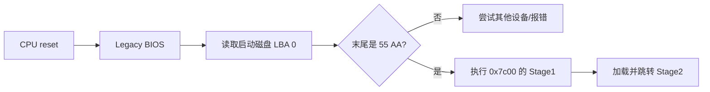
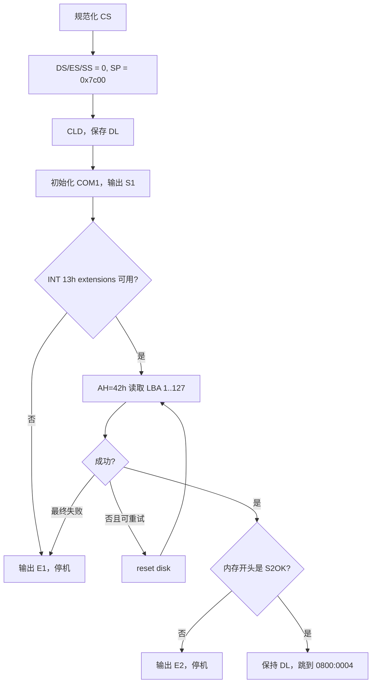

# M1：BIOS 如何找到 Stage2

> 状态：`verified`
> 对应任务：`TASK-M1-001`
> 实现会话：`20260803-1657-m1-stage1`

## 本章目标

读完后，你应该能解释 BIOS 为什么从 `0x7c00` 开始、`CS:IP` 和段寄存器是什么、
为什么必须初始化栈、`DL` 为什么要保存，以及 Stage1 如何安全读取并交接 Stage2。

## 1. 背景：开机时没有文件系统

CPU 复位后先执行固件。Legacy BIOS 完成基本硬件初始化并选择启动磁盘，但它不知道
我们的目录结构，也不会读取 ELF。它只按传统契约把启动设备的第一个 512-byte
扇区加载到物理地址 `0x7c00`，检查末尾 `55 AA`，然后跳入该区域。

这 512 bytes 就是 Stage1。空间很小，所以复杂工作必须交给更大的 Stage2。



## 2. 进入 Stage1 时哪些状态不能假定

BIOS 保证的核心交接很少：代码已经位于 `0x7c00`，`DL` 通常保存启动磁盘号。
段寄存器、栈的位置和方向标志不应依赖某个 BIOS 的偶然值。

### `CS:IP` 是什么

在 real mode 中，物理地址按下面公式计算：

```text
physical = segment × 16 + offset
```

`CS:IP` 分别是代码段和指令偏移。例如同一个物理地址 `0x7c00` 可以写成：

```text
0000:7c00 -> 0x0000 × 16 + 0x7c00 = 0x7c00
07c0:0000 -> 0x07c0 × 16 + 0x0000 = 0x7c00
```

Stage1 先做一次 far jump，把代码位置规范化成项目选择的表示，避免后续标签寻址
依赖 BIOS 使用哪一种等价的 `CS:IP`。

### `DS`、`ES`、`SS:SP` 是什么

- `DS`：普通数据访问默认使用的数据段。
- `ES`：字符串/复制指令和 BIOS buffer 常用的额外段。
- `SS:SP`：栈段和栈顶偏移；`call`、`ret`、`push`、`pop` 都依赖它。

初始化它们不是“把关键变量重置”，而是建立寻址坐标系和一块确定的栈空间。
如果 `SS:SP` 未知，第一次 `call` 就可能覆盖代码或 BIOS 数据。

## 3. Stage1 总体流程



实现位于 [boot/stage1.S](../../boot/stage1.S)。

## 4. 栈为什么放在 `0x7c00`

x86 栈向低地址增长：

```text
高地址
0x00007e00  BIOS 附近区域/未使用
0x00007c00  Stage1 起始，同时作为初始栈顶
             ^ SP 初始指向这里
             | push 后向下增长
0x00007000  栈可用区域
低地址
```

在 Stage1 开始执行后，代码位于 `0x7c00` 及以上，而短小的早期栈向下增长，二者
暂时不会相撞。这个选择只适用于当前受控启动阶段，不是通用内核栈方案。

更新 `SS:SP` 时先 `cli` 禁止中断，避免只更新了一半就发生中断并使用不一致的栈；
完成后再按需要恢复中断。

## 5. 为什么清除方向标志

`CLD` 把 Direction Flag 清零，使 `LODS`、`STOS`、`MOVS` 等字符串指令每次
操作后递增地址。若 BIOS 留下 `DF=1`，打印字符串或复制内存会反向移动。

这也是一个典型的启动原则：凡是后续代码依赖的 CPU 状态，都由自己显式建立。

## 6. 为什么保存 `DL`

BIOS 用 `DL` 传入启动磁盘号，硬盘常见值为 `0x80`。后续每次 INT 13h 磁盘调用
都要指定设备，而普通计算可能覆盖 `DL`，所以 Stage1 立即保存它，并在交接
Stage2 时恢复。

```text
BIOS: DL = boot drive
          |
          v
Stage1 boot_drive byte
          |
          +--> 每次 INT 13h 前恢复到 DL
          `--> 跳转 Stage2 前恢复到 DL
```

## 7. 用 DAP 读取 Stage2

项目使用 INT 13h extensions 的 `AH=42h`，通过 Disk Address Packet（DAP）描述：

- 要读多少扇区。
- 目标内存 `segment:offset`。
- 起始 LBA。

```text
磁盘                                  实模式内存
LBA 0      Stage1  ----------------> 0000:7c00
LBA 1..127 Stage2 保留区 ----------> 0800:0000 = physical 0x8000
```

一次读取 127 个扇区，共 `127 × 512 = 65024` bytes。目标 offset 从 0 开始，
因此不会越过一个 64 KiB offset 窗口。读取失败后先 reset disk，最多尝试三次。

## 8. `S2OK` 是交接契约，不是安全校验

Stage2 binary 的前四个字节固定为 ASCII `S2OK`，入口是紧随其后的 `0x8004`。
Stage1 在跳转前检查这四字节，可以发现空白镜像或明显错位：

```text
0x8000  'S'
0x8001  '2'
0x8002  'O'
0x8003  'K'
0x8004  Stage2 第一条指令
```

它不是 checksum，也不能检测任意损坏；其目标只是避免跳入显然无效的内存。

## 9. 如何验证：可观察性与错误注入

Stage1 同时向 BIOS VGA teletype 和 COM1 输出：

| 标记 | 含义 |
|---|---|
| `S1` | 已完成最基础初始化并进入 Stage1 主流程 |
| `E1` | 扩展磁盘接口不可用，或读取重试仍失败 |
| `E2` | Stage2 交接头不是 `S2OK` |

运行：

```sh
make image
make verify
make test-boot
```

`make verify` 检查 Stage1 恰好 512 bytes、末尾 `55aa`、镜像 LBA 0 内容一致。
`make test-boot` 会复制临时镜像并破坏 `S2OK` 首字节；预期只能看到
`S1 -> E2`，绝不能出现 `S2`。

## 10. 常见误解与排错

### “初始化寄存器就是把变量清零”

段寄存器和栈寄存器控制 CPU 如何解释地址。设置它们是在建立执行环境，不只是
给普通变量赋初值。

### “CLI 后 CPU 就不工作了”

`CLI` 只屏蔽可屏蔽硬件中断，CPU 仍继续执行指令。`HLT` 才让 CPU 等待事件。

### “BIOS 能读取文件名”

当前 BIOS 接口只读取磁盘扇区；Stage1 不理解分区和文件系统，所以 LBA 是固定的。

## 11. 当前限制与主流替代方案

当前实现面向 QEMU Legacy BIOS，使用固定 LBA、CHS 之外的 EDD 接口和最小 magic。
现代 PC 普遍采用 UEFI：固件能从 EFI System Partition 读取 PE/COFF 应用，提供
内存图和启动服务。成熟 bootloader 还会处理文件系统、配置、签名、随机化和多种
内核协议。项目保留 Legacy BIOS 是为了把最底层交接过程完整展开。

## 12. 练习

1. 手算 `0800:0004` 对应的物理地址。
2. 用 `od` 查看 `build/boot/stage1.bin` 最后两字节。
3. 在临时镜像中破坏 LBA 1 的 magic，解释为什么 Stage1 仍能读盘但拒绝跳转。
4. 阅读 Stage1 的 DAP，计算最大读取结束地址。

## 13. 拓展阅读

### 基础原理

- [Intel 64 and IA-32 Software Developer Manuals](https://www.intel.com/content/www/us/en/developer/articles/technical/intel-sdm.html)：Volume 1 的 real-address mode、寄存器与寻址基础。
- [Linux/x86 Boot Protocol](https://docs.kernel.org/arch/x86/boot.html)：比较成熟内核定义的 bootloader/kernel 交接字段。

### 当前主流实现

- [UEFI 最新规范入口](https://uefi.org/specifications)：比较 UEFI 2.11 的 image loading、Boot Services 和 memory map。
- [Linux EFI boot stub](https://docs.kernel.org/admin-guide/efi-stub.html)：了解 Linux 内核如何把自身作为 EFI application 启动。

### 项目内延伸

- [ADR-0004：Stage1/Stage2 交接契约](../decisions/0004-stage1-stage2-contract.md)
- [启动参考](../boot.md)
- [下一章：M2 Loader 与 Long Mode](m2-loader-long-mode.md)
