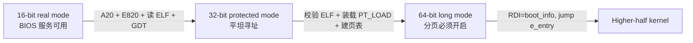
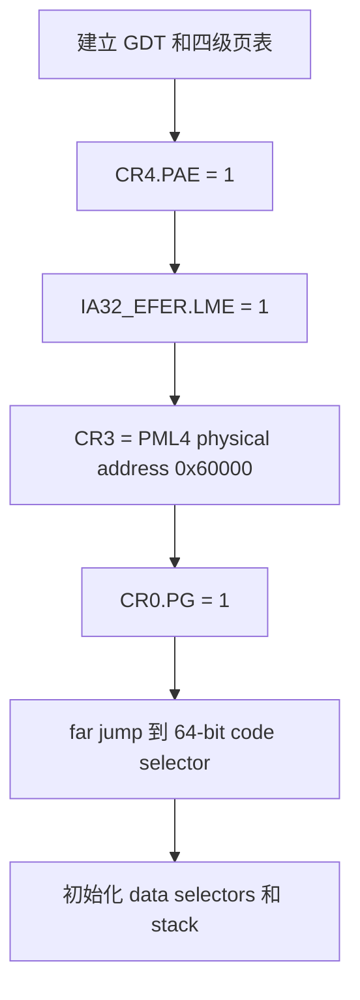

# M2：从 ELF Loader 到 Long Mode

> 状态：`verified`
> 对应任务：`TASK-M2-001`
> 实现会话：`20260803-1911-m2-long-mode`
> 图文核对：`20260803-2311-textbook-docs`

如果 GDT、selector、`CS` 或 16/32/64 位切换仍然陌生，请先读专题文章
[《从按下电源到 `kernel_main`》](kernel-boot-deep-dive.md)，再回到本章关注 M2
实现细节。

## 本章目标

读完后，你应该能描述 real/protected/long mode 的切换顺序，解释 A20、E820、
ELF program headers、GDT 和四级页表各自解决的问题，手工追踪一个 higher-half
虚拟地址，并区分 TLB miss、page fault 和页面置换。

## 1. Stage2 为什么存在

Stage1 只有 512 bytes，适合完成“找到下一阶段”，不适合解析 ELF、收集内存图
和构造页表。Stage2 接手时仍处于 16-bit real mode，但它要交付一个完全不同的
环境：64-bit CPU、可用栈、higher-half 映射和结构化 boot info。



模式切换不是一次跳跃。BIOS 中断只能在 real mode 阶段使用；ELF 校验和大块内存
操作放在 32-bit protected mode；long mode 必须在页表和控制寄存器全部准备好后
才能开启。

## 2. 进入 Stage2 时的交接状态

Stage1 已保证：

- Stage2 的 LBA 1..127 已加载到物理 `0x8000`。
- `0x8000` 开始是 `S2OK`，CPU 从 `0x8004` 执行。
- `DL` 仍是 BIOS boot drive。
- CPU 仍处于 real mode，BIOS interrupt services 可用。

Stage2 仍会重新初始化 `DS/ES/SS:SP`、执行 `CLD` 并保存 `DL`，避免把自身正确性
建立在 Stage1 的临时寄存器值上。

## 3. 启用 A20

最早的 x86 为兼容 20-bit 地址总线，会让超过 1 MiB 的地址回绕。内核 segment
要加载到 `0x100000` 以上，因此必须打开 A20 gate。

```text
A20 关闭（概念示例）               A20 开启
0x00100000 -> 回绕到低地址          0x00100000 -> 真正的 1 MiB
复制内核可能覆盖 BIOS/Stage1        可以安全加载 higher memory
```

当前代码使用 QEMU `pc` 支持的 port `0x92` fast A20 gate。它简洁但偏向受控环境；
真实硬件兼容实现通常还会检测 A20 状态，并准备键盘控制器等 fallback。

## 4. E820：先问固件哪些内存可以用

“机器有 128 MiB RAM”不表示整个 `0..128 MiB` 都可自由覆盖。低地址包含 BIOS、
设备窗口和保留区。Stage2 用 `INT 15h, EAX=E820h` 反复获取 memory map：

```text
E820 entry（24 bytes）
+0x00  base        u64
+0x08  length      u64
+0x10  type        u32   1 = usable RAM
+0x14  attributes  u32
```

最多保存 64 条到 `0x18100`。装载 ELF 前，当前 loader 要求一个 `type=1` entry
完整覆盖所有 `PT_LOAD` 的物理范围；否则输出 `M2:MEMORY ERROR` 并停机。

这是保守的启动检查。完整内存管理还要处理相交区间、保留 bootloader/页表/内核、
合并区域，并建立页框元数据，这属于 M4。

## 5. 从磁盘暂存完整 ELF

Stage2 从 LBA 128 开始读取构建时计算出的 ELF 扇区数，分批放入：

```text
0x00020000                          0x00060000
    |<--------- 256 KiB ------------->|
    +----------------------------------+
    | kernel.elf staging copy          |
    +----------------------------------+
```

BIOS 单次读取限制为 127 sectors，所以循环更新 DAP 的 LBA、扇区数和目标 segment。
每块最多重试三次；最终失败输出 `M2:DISK ERROR`。256 KiB 是 M2 的低内存暂存
策略限制，不是 ELF 格式或最终内核的限制。

## 6. ELF：为什么加载 segment，不是复制整个文件

ELF 文件同时服务于链接器、调试器和 loader。Sections 描述 `.text/.data/.bss` 等
链接视图；program headers 描述运行时需要装入内存的 segments。

```text
kernel.elf 文件                         装载后的物理内存

ELF header
Program Header Table
  PT_LOAD offset A  -----------------> p_paddr A
      filesz bytes                       复制 filesz
      memsz bytes                        再清零 memsz-filesz（BSS）
  PT_LOAD offset B  -----------------> p_paddr B
Section Table（loader 不依赖）
Debug sections（不装载）
```

当前 loader 检查：

- ELF64、little-endian、ET_EXEC、x86-64。
- ELF header/program-header 大小和文件边界。
- 最多 32 个 program headers。
- `p_filesz <= p_memsz`，且文件/内存范围不溢出。
- `PT_LOAD` VMA 位于 `0xffffffff80000000` 以上。
- 物理地址位于 `0x00100000..0x040fffff`。
- `e_entry` 位于一个 executable `PT_LOAD` 内。

入口最终从 ELF `e_entry` 读取，loader 没有把 `_start` 地址硬编码为控制流常量。

## 7. GDT：进入 protected/long mode 的门票

Global Descriptor Table（GDT）为 segment selector 提供描述符。Stage2 建立最小表：

```text
selector 0x00  null
selector 0x08  32-bit code
selector 0x10  32-bit data
selector 0x18  64-bit code
selector 0x20  64-bit data
```

进入 protected mode：加载 `GDTR`，设置 `CR0.PE`，再执行 far jump，使 `CS`
加载 32-bit code selector 并刷新指令流。进入 long mode 时再次 far jump 到 64-bit
code selector。

这里的 GDT 只服务启动切换。M3 会建立内核自己的 GDT/TSS，为中断和后续 Ring 3
切换准备正式环境。

## 8. 四级页表和 higher-half

long mode 下，CPU 使用虚拟地址。当前启动页表固定放在物理
`0x60000..0x84fff`：

```text
PML4  0x60000
├─ [0]   -> low PDPT  0x61000
│           └─ [0] -> low PD 0x62000
│                     └─ 512 × 2 MiB huge page
│
│   VA 0x0000000000000000..0x000000003fffffff
│      -> 同值 PA（低 1 GiB identity map）
│
└─ [511] -> high PDPT 0x63000
             └─ [510] -> high PD 0x64000
                         └─ 32 entries -> 32 PTs 0x65000..0x84fff
                                         └─ 16384 × 4 KiB PTE

    VA 0xffffffff80000000..0xffffffff83ffffff
       -> PA 0x00100000..0x040fffff（64 MiB）
```

为什么同时保留两套映射：

- identity map 让开启 paging 前后执行中的 Stage2、栈、页表和 boot info 地址不变。
- higher-half map 让按高虚拟地址链接的内核能够执行，同时代码实际位于低物理 RAM。

地址 `0xffffffff80000000` 的关键索引为：

```text
PML4 index = 511
PDPT index = 510
PD index   = 0
PT index   = 0
offset     = 0
最终 PA    = 0x00100000
```

页表项当前统一为 Present + Writable，且没有设置 NX。这是启动页表，不是最终权限
模型；M4 会按 ELF flags 建立正式映射并移除不必要的 identity map。

## 9. 开启 Long Mode 的顺序

[boot/stage2.S](../../boot/stage2.S) 按处理器要求执行：



顺序错误通常不会得到友好错误信息，可能直接触发异常、双重故障甚至重置，因此
Stage2 在开启 paging 之前完成 ELF 和内存边界检查。

## 10. `boot_info v1`：Loader 与 Kernel 的 ABI

Stage2 不能只“跳过去”，还要告诉内核内存图和实际加载结果。64-byte
`boot_info` 位于物理 `0x18000`，通过 SysV AMD64 ABI 的第一个参数寄存器 `RDI`
传入：

| 字段 | 含义 |
|---|---|
| `version/size` | ABI 演进与边界检查 |
| `boot_drive` | BIOS 启动磁盘号 |
| `e820_count/e820_entries` | 固件内存图 |
| `kernel_phys_start/end` | 实际 PT_LOAD 物理范围 |
| `kernel_virt_start/end` | ELF higher-half 范围 |
| `kernel_entry` | ELF `e_entry` |

内核入口 `_start` 建立自己的 bootstrap stack 后调用 `kernel_main(info)`。
[kernel/main.c](../../kernel/main.c) 校验版本和数量，打印范围与每个 E820 entry，
最后输出 `K2:HALT`。

## 11. TLB Miss、Page Fault 与页面置换

这三个概念属于不同层次：

```text
CPU 访问虚拟地址
  |
  +-- TLB 有翻译 ----------> 直接访问 cache/RAM
  |
  `-- TLB miss ------------> MMU 硬件 page walk
                               |
                               +-- PTE present -> 填入 TLB，继续
                               `-- 不存在/权限错 -> #PF page fault
                                                    -> OS handler
```

- CPU cache miss：硬件从更低层 cache 或 RAM 取数据。
- TLB miss：MMU 自动遍历当前页表；正常情况下内核不介入。
- Page fault：映射不存在或权限不允许，需要异常处理程序决定如何处理。
- 页面置换：内存紧张时由 OS 选择页面回收/换出，是更高层策略。

M2 没有动态映射、page-fault handler、swap、LRU/Clock 或页面置换。M3 才会建立
异常入口，M4 才会实现页框分配和 `map/unmap`；当前 Roadmap 也没有把磁盘 swap
列为第一版目标。

## 12. 如何验证

```sh
make clean
make image
make verify
make test-boot
timeout 3s make run
```

测试脚本把串口写入临时文件并轮询场景终止标记；看到标记后会立即回收 QEMU。
本地 QEMU debug build 冷启动较慢时，可以增加最大等待时间：

```sh
make QEMU_TEST_TIMEOUT=60s test-boot
```

Guest 输出终止标记后停在 `HLT`，QEMU 不会自行退出；harness 一看到标记就主动
终止 QEMU。超时现在只表示“在最大期限内没有观察到完成标记”。

正常串口应包含：

```text
S1
S2
M2:E820 OK
M2:ELF OK
K2:LONG MODE OK
K2:BOOT ...
K2:E820[...]
K2:HALT
```

自动负路径包括：

| 实验 | 期望 |
|---|---|
| 损坏 `S2OK` | Stage1 输出 `E2`，不进入 Stage2 |
| 损坏 kernel ELF magic | Stage2 输出 `M2:ELF ERROR` |
| QEMU 仅提供 1 MiB RAM | Stage2 输出 `M2:MEMORY ERROR` |

`make verify` 还检查 ELF entry、LMA/VMA、W+X、undefined symbols、staging 上限和
镜像字节一致性。

## 13. 常见误解与排错

### “进入 64 位只要加 `.code64`”

`.code64` 只告诉 assembler 如何编码；CPU 是否按 64-bit 解释取决于 GDT、控制
寄存器、EFER 和 paging 状态。

### “higher-half 表示内核真的放在巨大的物理地址”

不是。`0xffffffff80000000` 是虚拟地址；当前对应物理 `0x00100000`。

### “E820 type 1 就可以立刻全部分配”

仍需扣除 loader、内核、页表、设备和其他保留范围。M2 只验证内核加载范围。

### “ELF section 决定 loader 复制什么”

运行时 loader 看 program headers 和 `PT_LOAD`；section table 可以被剥离。

## 14. 当前限制与主流实现

当前 Stage2 使用固定低内存区域、固定 64 MiB higher-half window、统一 writable
权限和低 1 GiB identity map。成熟内核会动态管理启动内存、处理更多 firmware
内存属性、支持地址随机化、大页/五级页表、严格 W^X/NX、每进程地址空间和精细
TLB shootdown。Linux 的早期 `memblock`、架构页表代码和通用 MM 层把这些职责
分开；本项目将在 M4 先实现其中最小、可观察的一部分。

## 15. 练习

1. 手算 `0xffffffff80001234` 的四级索引和最终物理地址。
2. 从 `readelf -lW` 找到每个 `PT_LOAD`，验证 `filesz <= memsz`。
3. 解释为什么 BSS 不需要占用相同大小的 ELF 文件空间。
4. 找出 identity map 中 `0x8000` 所属的 2 MiB PDE。
5. 思考移除 identity map 前必须迁移或重新映射哪些 boot data。

## 16. 拓展阅读

### 基础原理

- [Intel 64 and IA-32 Software Developer Manuals](https://www.intel.com/content/www/us/en/developer/articles/technical/intel-sdm.html)：Volume 3A 的 protected mode、IA-32e paging、控制寄存器和异常。
- [GNU ld：VMA 与 LMA](https://sourceware.org/binutils/docs/ld/Output-Section-LMA.html)：理解 ELF 装载地址。
- [Linux：Page Tables](https://docs.kernel.org/mm/page_tables.html)：页表层级、MMU、TLB 与 page fault 的系统说明。

### 当前主流实现

- [Linux：Boot-time memory management](https://docs.kernel.org/core-api/boot-time-mm.html)：了解 `memblock` 如何在正常分配器可用前管理内存区域。
- [Linux/x86 Boot Protocol](https://docs.kernel.org/arch/x86/boot.html)：比较 `boot_params` 与本项目 `boot_info v1`。
- [UEFI 最新规范入口](https://uefi.org/specifications)：比较 UEFI memory map 与本项目 BIOS E820 路径。

### 项目内延伸

- [ADR-0005：M2 内存布局与 boot info](../decisions/0005-m2-loader-memory-and-boot-info.md)
- [启动参考](../boot.md)
- [M4 计划：最终页表和内存管理](../../plan.md#M4物理与虚拟内存管理)
