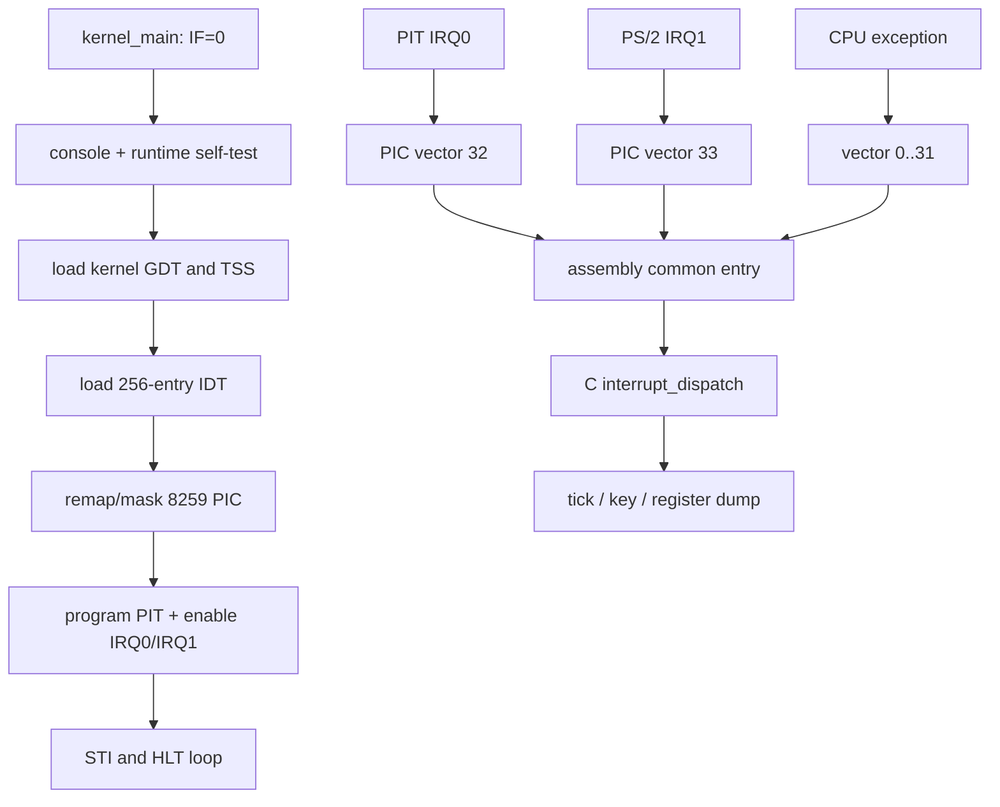

# M3：从串口打印到可诊断的中断内核

> 状态：`verified`
> 对应任务：`TASK-M3-001`
> 代码基线：会话 `20260818-2141-m3-interrupts`

## 本章目标

读完后，读者应该能够：

- 区分 CPU exception、外部 IRQ、IDT vector 和 C handler。
- 解释内核为何不能长期使用 loader 的临时 GDT。
- 画出 CPU、8259 PIC、8254 PIT、PS/2 keyboard 与统一 handler 的关系。
- 根据汇编压栈顺序解读 `struct interrupt_frame`。
- 运行 timer/keyboard 正常路径和 divide/page-fault 失败路径，并判断输出是否可信。

## 1. 背景：为什么需要这一阶段

M2 证明 CPU 能进入 64-bit higher-half C 代码，但它仍然是一个“关着中断打印后
停机”的程序。真实内核必须处理两类异步控制流：

1. **Exception（异常）**：当前指令执行时由 CPU 检测，例如除零 `#DE`、缺页
   `#PF`、一般保护错误 `#GP`。
2. **Interrupt Request（IRQ，中断请求）**：设备在指令边界请求 CPU 服务，例如
   PIT timer 的 IRQ0 和 PS/2 keyboard 的 IRQ1。

两者最后都通过 **Interrupt Descriptor Table（IDT，中断描述符表）** 找到入口，
但来源、是否携带 error code、是否可以恢复完全不同。若入口压栈规则错一个字段，
`iretq` 就会把普通整数当成 RIP 或 CS，常见结果不是漂亮的报错，而是 double fault
甚至 triple fault 后重启。

M3 还补上内核最小运行库和 console。异常处理不能依赖宿主 libc，也不能只写 VGA：
自动测试和无图形环境需要串口，而人在 QEMU 窗口中调试时 VGA 更直接。因此同一
`console_*` 调用会同时写 COM1 和 VGA text buffer。

## 2. 进入本阶段时机器是什么状态

M2 调用 `_start` 时满足：

| 项目 | 状态 |
|---|---|
| CPU mode | IA-32e long mode，CPL0 |
| `RIP` | higher-half ELF entry `_start` |
| `RSP` | 内核 ELF 内的 16 KiB bootstrap stack |
| `RDI` | identity-mapped `boot_info v1` pointer |
| paging | 低 1 GiB identity map；内核 64 MiB higher-half map |
| GDT | loader 的临时 GDT，内核不拥有其生命周期 |
| IDT/TSS | 尚未初始化 |
| `RFLAGS.IF` | 0，maskable IRQ 关闭 |
| PIC | BIOS 遗留配置，vector 可能与 CPU exception 重叠 |
| console | M2 私有 COM1 函数，无 VGA 抽象或 formatter |

低地址 identity map 让 M3 可以访问 VGA `0xb8000` 和 port-mapped legacy devices。
这仍是临时条件：M4 建立最终页表时必须显式保留需要的 MMIO/identity 访问或提供
新的映射。

## 3. 总体设计



设计原则是“汇编只规范机器帧，C 决定策略”：

- 每个 stub 处理 CPU 是否已经压入 error code 的差异。
- common entry 保存通用寄存器，动态对齐栈后调用 C。
- C 根据 vector 分派 exception、timer、keyboard，并为外部 IRQ 发送 EOI。
- fatal exception 关中断、打印帧并 halt；M3 不尝试跳过故障指令继续运行。

## 4. 实现方法

### 4.1 freestanding 运行库与双后端 console

`kernel/lib/string.c` 实现 `memcpy`、`memset`、`memmove` 和 `strlen`。
`memmove` 根据源/目标关系选择向前或向后复制，因此重叠区不会覆盖尚未读取的数据。
`kernel/main.c:runtime_self_test` 在启动时执行重叠复制并逐字节核对，成功才输出
`K3:RUNTIME OK`。

`kernel/console.c` 负责：

- 初始化 COM1 为 115200 8N1。
- 清空并维护 `0xb8000` 的 80x25 VGA text buffer，支持换行、回车、退格和滚屏。
- 提供 `%c/%s/%d/%u/%x/%p` 及 64-bit `ll` 形式的简化 formatter。
- `panic` 先执行 `cli`，同时输出诊断，然后永久 `hlt`。

这里的 formatter 不是 ISO C `printf` 完整实现；不支持浮点、精度、位置参数或宽度。

### 4.2 内核 GDT 与 TSS

`kernel/arch/x86_64/gdt.c` 建立内核自己的 40-byte GDT。`descriptors.S` 执行
`lgdt`，用 `lretq` reload `CS=0x08`，设置 data selectors，再用 `ltr` 加载
`TR=0x18`。

64-bit **Task State Segment（TSS）** 不再像早期 x86 那样保存完整任务上下文；
内核主要使用其中的 privilege stack 和 **Interrupt Stack Table（IST）** 指针。
M3 把 `RSP0` 指向 bootstrap stack，并为 double fault 的 IDT gate 设置 `IST1`，
指向独立 16 KiB 栈。即使普通内核栈损坏，`#DF` 仍有机会进入已知栈并输出诊断。

### 4.3 IDT 与统一汇编入口

`interrupts.c` 建立 256 个 16-byte interrupt gates。vector `0..47` 有独立 stub，
其余 gate 指向 `isr_unhandled`。

CPU 只为部分 exception 自动压 error code，例如 `#DF/#TS/#NP/#SS/#GP/#PF/#AC`。
没有 error code 的 stub 先压 0；所有 stub 再压 vector。于是 common entry 总能按相同
偏移读取：

```text
CPU:       rflags, cs, rip, [error_code only for selected exceptions]
stub:      synthetic error_code if needed, vector
common:    rax..r15
```

common entry 保存 15 个通用寄存器，以 16-byte 边界对齐 `RSP`，把原始 frame pointer
放入 `RDI` 调用 `interrupt_dispatch`。返回时按相反顺序恢复寄存器，丢弃
`vector/error_code` 后执行 `iretq`。

### 4.4 exception 诊断

vector 小于 32 时，`exception_halt` 打印：

- exception vector、名字和 error code；
- `RIP/CS/RFLAGS`；
- `RAX..R15`；
- `#PF` 额外读取控制寄存器 `CR2`，它保存触发 fault 的线性地址。

测试模式 1 用真实 `divq` 除以零产生 vector 0。M4 接管测试 harness 后，模式 2
解引用未映射的 `0xffffc00000000000` 产生 vector 14；模式 3/4 进一步复用同一
handler 验证 read-only 与 NX fault。它们都不是直接打印伪造 marker。

### 4.5 PIC、PIT 与键盘

BIOS 常把 8259 PIC 映射到与 CPU exception 重叠的低 vectors。`pic_init` 发送 ICW1-4，
把 master/slave remap 到 `32/40`，随后 mask 全部线路。PIT 和 keyboard 初始化分别
unmask IRQ0、IRQ1。

PIT channel 0 输入时钟约为 1,193,182 Hz。M3 写入 divisor
`1193182 / 100 = 11931`，目标约 100 Hz。IRQ0 handler 只递增 `u64 tick_count`；主循环
先观察 tick 至少为 3，再等待它至少前进 5，输出 first/second 作为“确实递增”的证据。

keyboard IRQ1 从 I/O port `0x60` 读取 set-1 scan code。第一版处理基本 ASCII、左右
Shift、make/release 区分。收到字符时输出 scan code 和字符；测试通过 QEMU HMP
发送 `sendkey a`，guest 必须观察到 scan code `0x1e` 和字符 `a`。

## 5. 关键数据布局

### GDT 与 vector

| 对象 | 值/范围 | 用途 |
|---|---:|---|
| kernel code selector | `0x08` | IDT gate 与 `CS` |
| kernel data selector | `0x10` | `DS/ES/SS` |
| TSS selector | `0x18` | `TR`，descriptor 占两个 GDT slots |
| CPU exceptions | `0..31` | `#DE=0`、`#GP=13`、`#PF=14` 等 |
| master PIC | `32..39` | IRQ0..7 |
| slave PIC | `40..47` | IRQ8..15 |
| timer | vector 32 | PIT IRQ0 |
| keyboard | vector 33 | PS/2 IRQ1 |

### `interrupt_frame` 精确偏移

| offset | 字段 | 来源 |
|---:|---|---|
| 0..56 | `r15..r8` | common entry |
| 64..112 | `rsi,rdi,rbp,rdx,rcx,rbx,rax` | common entry |
| 120 | `vector` | per-vector stub |
| 128 | `error_code` | CPU 或 synthetic zero |
| 136 | `rip` | CPU |
| 144 | `cs` | CPU |
| 152 | `rflags` | CPU |

M3 只有 CPL0 -> CPL0 entry，因此表中没有旧 `rsp/ss`。从 ring 3 进入时 CPU 会额外
压入它们；M6 必须扩展结构，不能用当前 160-byte 布局盲目解析用户入口。

### Legacy I/O ports

| port | 设备 | M3 操作 |
|---:|---|---|
| `0x20/0x21` | master PIC command/data | remap、mask、EOI |
| `0xa0/0xa1` | slave PIC command/data | remap、mask、EOI |
| `0x40/0x43` | PIT channel 0/command | 写 mode 与 divisor |
| `0x60` | PS/2 data | 读 scan code |
| `0x3f8..0x3ff` | COM1 | 串口 console |
| `0xb8000` | VGA text memory | 屏幕 console（memory，不是 port） |

## 6. 如何验证

运行完整验收：

```sh
make clean
make image
make verify
make test-boot
```

当前 `make test-boot` 自动构建五种内核；mode 0/1 继续覆盖本章正常 IRQ 与 divide
回归，mode 2..4 由 M4 扩展 page-fault 权限实验：

| `KERNEL_TEST_MODE` | 路径 | 终止证据 |
|---:|---|---|
| 0 | PIT + keyboard 正常路径 | `K3:TIMER OK`、`K3:KEY char=a`、`K3:HALT` |
| 1 | `divq` 除零 | vector 0、寄存器帧、`K3:DIVIDE ERROR OK` |
| 2 | 未映射地址读取 | vector 14、CR2、`K3:PAGE FAULT OK` |
| 3 | 写 read-only page | vector 14、error `0x3` |
| 4 | NX page instruction fetch | vector 14、error `0x11` |

正常路径的关键输出应保持顺序：

```text
K3:RUNTIME OK
K3:GDT TSS OK
K3:IDT OK
K3:PIC OK vectors=32..47
K3:PIT OK hz=100
K3:KEYBOARD READY
K3:READY
K3:KEY char=a scan=0x1e
K3:TIMER OK first=... second=... hz=100
K3:KEYBOARD OK last=a events=1
K3:HALT
```

timer 与 keyboard 输出的相对顺序可因宿主调度略有变化，但 `second >= first + 5`、
字符为 `a` 和最终 marker 必须成立。

测试还重跑 M2 的 corrupt stage2、invalid ELF、1 MiB low-memory 路径。因此 M3 的
“正常启动”不能以破坏早期 loader 错误处理为代价。

## 7. 常见误解与排错

### “有 GDT 了，为什么内核还要再建一个？”

loader GDT 的职责是完成模式切换。内核需要掌握 descriptor 生命周期、TSS、IST 和
未来的 user selectors。继续引用 loader 私有表会让两个阶段的契约互相渗透。

### “IRQ0 就是 vector 0 吗？”

不是。IRQ 是 PIC 线路编号；vector 是 CPU 查 IDT 的索引。M3 remap 后 IRQ0 -> 32，
IRQ1 -> 33。vector 0 永远是 CPU Divide Error。

### QEMU 到 `K3:READY` 后没有 `K3:TIMER OK`

优先检查：

1. `sti` 是否执行；
2. PIC IRQ0 mask 是否清除；
3. IDT vector 32 是否指向 `isr_32`；
4. handler 是否给 master PIC 发送 EOI；
5. 汇编帧恢复后 `iretq` 是否返回正确 RIP。

### timer 正常但没有键盘字符

检查 HMP FIFO 是否写入 `sendkey a`、IRQ1 是否 unmask、port `0x60` 是否读取、set-1
表中 `0x1e` 是否映射为 `a`。不要把 QEMU monitor 输出误当作 guest serial 输出。

### exception 后直接重启且没有串口帧

这通常是 entry frame、IDT selector、TSS descriptor 或 stack alignment 错误，而不是
formatter 问题。用 `make debug` 在 `lgdt/lidt` 和对应 stub 附近断点；若是 double
fault，确认 vector 8 gate 的 IST 字段和 TSS `IST1`。

## 8. 当前限制与下一阶段

- 仍使用 legacy 8259/PIT/PS2，没有 Local APIC、IOAPIC、HPET 或多核支持。
- keyboard 只支持 set-1 基本 ASCII 和 Shift；没有 Caps Lock、扩展码、LED、输入队列。
- console 无锁；当前单核且 handler 很短。M5 抢占和未来 SMP 必须增加同步策略。
- fatal exception 只诊断并 halt，不支持恢复、signal 或用户进程终止。
- TSS 已有 `RSP0/IST1`，但尚无 ring 3；当前 frame 没有用户 `rsp/ss` 和 `swapgs`。
- M4 将替换临时页表，并必须确保 VGA/设备访问与 TSS/IDT/GDT 内存仍有效。

## 9. 练习

1. 根据 `descriptors.S` 的 push 顺序，手工推导 `rax/vector/rip` 三个偏移并与表核对。
2. 把 PIT 目标改为 50 Hz，预测 divisor 和测试耗时；不要提交修改后的默认值。
3. 为键盘加入 Caps Lock 状态，区分字母与数字行的 Shift/Caps 组合。
4. 增加一个 `#UD` 测试模式，用 `ud2` 验证 vector 6，仍复用统一 frame。
5. 阅读 page-fault error code 各位含义，在输出中解释 present/write/user 三个位。

## 10. 拓展阅读

### 基础原理

- [Intel 64 and IA-32 Software Developer's Manuals](https://www.intel.com/content/www/us/en/developer/articles/technical/intel-sdm.html)：
  Volume 3A 的 protected-mode management、interrupt/exception handling、IDT 和 TSS
  是本章 GDT/IDT/IST 的权威定义。
- [QEMU Monitor documentation](https://www.qemu.org/docs/master/system/monitor)：
  `sendkey` 命令说明测试如何把 host 输入送入 guest，而不是伪造内核变量。

### 当前主流实现

- [Linux x86-64 Kernel Entries](https://www.kernel.org/doc/html/latest/arch/x86/entry_64.html)：
  展示生产内核如何处理 error-code 差异、IST、`swapgs`、用户/内核入口和大量特殊
  vectors；复杂度远高于 M3 的 CPL0 单核入口。
- [QEMU i8259 model](https://gitlab.com/qemu-project/qemu/-/blob/master/hw/intc/i8259.c)、
  [i8254 model](https://gitlab.com/qemu-project/qemu/-/blob/master/hw/timer/i8254.c) 与
  [PS/2 controller model](https://gitlab.com/qemu-project/qemu/-/blob/master/hw/input/pckbd.c)：
  用于对照测试环境中 legacy devices 的上游实现。

### 项目内延伸

- [ADR-0006](../decisions/0006-m3-interrupt-architecture.md)：selector、vector 和 frame
  的稳定契约。
- [内核启动深度讲解](kernel-boot-deep-dive.md)：回顾 loader 临时 GDT 和 long-mode
  交接，理解为什么 M3 必须接管描述符表。
- [M4 内存管理](m4-memory-management.md) 已在本中断基础上实现最终页表、
  page-fault 权限实验和内存分配器。

## 完成检查

- [x] 背景、输入状态、实现、验证、限制均已覆盖。
- [x] 至少一张流程图和一张精确布局图/表。
- [x] 图、常量、文件路径与当前代码一致。
- [x] 正常路径与关键失败路径有证据。
- [x] 拓展阅读链接已核对，并标注用途。
- [x] `TASKS.md`、`PROJECT_STATUS.md` 和会话日志在会话收尾时同步。
