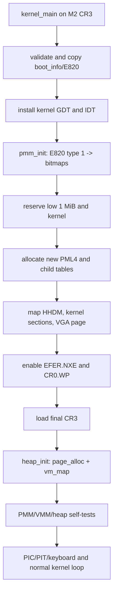
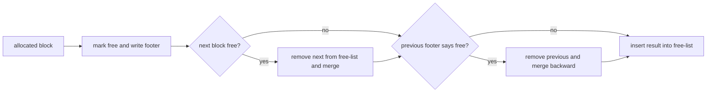

# M4：从 E820 到可验证的内核内存管理

> 状态：`verified`
> 对应任务：`TASK-M4-001`
> 代码基线：会话 `20260818-2231-m4-memory`

## 本章目标

读完后，读者应该能够：

- 区分物理页框、虚拟页、页表页、物理直映地址与普通 heap 地址。
- 解释为什么 E820 type 1 RAM 仍不能全部直接交给分配器。
- 从一个 48-bit canonical virtual address 计算四级页表索引。
- 说明 PTE 的 Present/Writable/User/NX 位和 `CR0.WP`、`EFER.NXE` 的关系。
- 画出 boundary-tag heap 分裂与前后合并过程。
- 运行 PMM/VMM/heap 正常实验，以及 unmapped、read-only、NX 三种真实 page fault。

## 1. 背景：为什么“有 RAM”还不等于“会管理内存”

M2 已经从 BIOS 得到 E820 map，也建立了页表，但那两件事只解决“loader 如何找到
可放内核的 RAM”和“CPU 如何跳入高地址”问题。它没有回答：下一张页表放哪一页、
释放的页能否复用、内核 text 能否被写、可变大小对象如何分配。

M4 把问题分成三层：

1. **Physical Memory Manager（PMM，物理内存管理器）**管理 4 KiB physical frames。
2. **Virtual Memory Manager（VMM，虚拟内存管理器）**把 virtual pages 映射到 frames，
   并施加读写/执行权限。
3. **Kernel heap（内核堆）**在连续虚拟地址中提供 `kmalloc/kfree`，把任意字节大小
   的对象请求转换成底层页请求。

三层不能倒置依赖：PMM bitmap 在静态 BSS 中，不依赖 heap；VMM 的新页表从 PMM
取页；heap 最后才同时调用 PMM 与 VMM。否则第一次 `kmalloc` 会为了扩展 heap 请求
页表，而页表分配又请求 `kmalloc`，形成无法启动的循环。

## 2. 进入 M4 时机器状态

`kernel_main` 开始执行时继承 M2/M3 的状态：

| 项目 | M4 接手值 |
|---|---|
| CPU | x86_64 long mode，CPL0，单核，`RFLAGS.IF=0` |
| `CR3` | M2 位于物理 `0x60000` 的临时 PML4 |
| low mapping | 低 1 GiB identity-map，统一 present+writable |
| kernel mapping | `0xffffffff80000000` 起 64 MiB，统一 present+writable |
| `RDI` | 指向低地址 `0x18000` 的 `boot_info v1` |
| E820 pointer | `boot_info.e820_entries=0x18100`，依赖 identity map |
| GDT/IDT | M4 初始化前换成内核自己的 higher-half 静态表 |
| console | COM1 加 identity address `0xb8000` VGA |

最关键的不变量是：切换 CR3 前必须复制 `boot_info` 和 E820。若先删除 identity map，
原指针 `0x18000/0x18100` 会立即变成不可访问地址。`preserve_boot_info` 把结构与最多
64 个 entries 复制到 kernel BSS，并把副本中的 pointer 改成 higher-half 静态数组。

## 3. 从启动页表到最终内存系统



切换点前后执行地址始终是 higher-half kernel address，bootstrap stack 也在 kernel BSS，
所以新页表只要在写 CR3 之前完整映射 text、rodata、data/BSS，下一条 C 指令就能继续。
GDT/IDT 的 base 同样是 higher-half 静态地址。最终页表不再依赖 loader 私有页表。

## 4. PMM：从 E820 建立页所有权

### 4.1 对齐与保留

`kernel/mm/pmm.c` 初始把所有 frame 标为 occupied，然后只对 E820 type 1 range 做：

```text
usable_start = align_up(base, 4096)
usable_end   = align_down(base + length, 4096)
```

边缘不足一页的字节不能分配，因为它们可能与下一个 firmware range 共用同一 frame。
M4 把地址截断到 1 GiB；这对应 262,144 个 frames，每个 bitmap 占 32 KiB。

随后重新占用两个区域：

| 物理范围 | 保留原因 |
|---|---|
| `0..0x000fffff` | IVT/BDA、BIOS、boot stages、boot info、M2 页表/栈、VGA |
| `kernel_phys_start..kernel_phys_end` | 当前 ELF PT_LOAD、BSS、stack 和 PMM metadata |

E820 的“usable”只说明 firmware 不保留它，不代表当前内核没有把自己放在那里。

### 4.2 三张 bitmap 为什么各有职责

| bitmap | 位为 1 的含义 |
|---|---|
| managed | 原始 E820 type 1 且低于 1 GiB |
| allocated | 当前不可分配；包含保留页与已分配页 |
| allocator-owned | 这一页确实由 `page_alloc` 返回给调用者 |

`page_alloc` 扫描 `managed & ~allocated`，设置 allocated 与 allocator-owned。
`page_free` 除了检查 4 KiB 对齐和范围，还要求 allocator-owned=1。这使得调用者不能
把物理 0 页、kernel text 或任意“看起来在 RAM 中”的地址伪装成已分配页释放。

第一版使用线性 word 扫描和 `ctz` 找第一个空位，简单但不是常数时间。统计结构记录
managed/free/allocated pages，64 页压力实验要求释放后的 free count 精确回到起点。

## 5. VMM：四级页表、最终地址空间与权限

### 5.1 页表 walk

x86_64 的 4 KiB 映射用四层表，每张表 512 个 8-byte entries：

```text
63                         48 47      39 38      30 29      21 20      12 11       0
+----------------------------+----------+----------+----------+----------+----------+
| canonical sign extension   | PML4 idx | PDPT idx | PD idx   | PT idx   | offset   |
+----------------------------+----------+----------+----------+----------+----------+
                                  9 bit      9 bit      9 bit      9 bit     12 bit
```

`walk_to_pte` 从 `root_physical` 开始。缺少中间表且 `create=true` 时，用 `page_alloc`
取得一页、清零、在父 entry 填 physical address 与 Present/Writable；到 PT 后返回
目标 PTE。页表本身保存 physical address，不保存 HHDM virtual address。

在加载最终 CR3 前，M2 identity map 允许通过 `physical` 写新页表；加载后，
`table_pointer` 改用 `0xffff800000000000 + physical`。这正是 HHDM（Higher-Half
Direct Map，高半区物理直映）存在的核心理由之一。

### 5.2 最终虚拟地址布局

| virtual range | physical/用途 | 权限 |
|---|---|---|
| `0x00000000000b8000..0xb8fff` | VGA text page identity map | RW-, supervisor |
| 其他低地址 | 不映射 | 访问产生 `#PF` |
| `0xffff800000000000..0xffff80003fffffff` | physical `0..1 GiB` HHDM | NX；kernel text/rodata alias 只读 |
| `0xffffc00000000000..+0xfff` | VMM/权限测试页 | 按测试动态改变 |
| `0xffffc10000000000..0xffffc10000ffffff` | 16 MiB kernel heap window | RW-, 按需映射 |
| `0xffffffff80000000..kernel_end` | kernel ELF | text R-X，rodata R--，data/BSS RW- |

HHDM 的普通区用 2 MiB huge PDE，减少页表数量。物理 0 所在区以及任何与 kernel
physical range 重叠的 2 MiB chunk 会拆成 4 KiB PTE：这样 text/rodata 的 HHDM
别名也能保持只读且 NX，不会绕过 higher-half kernel mapping 的 W^X 意图。

### 5.3 权限位为什么需要控制寄存器配合

| 项目 | 作用 |
|---|---|
| PTE bit 0 `P` | 0 表示不存在，访问产生 non-present `#PF` |
| PTE bit 1 `W` | 0 表示只读 |
| PTE bit 2 `U` | 0 表示只有 supervisor 可访问 |
| PTE bit 63 `NX` | 1 禁止 instruction fetch |
| `CR0.WP` | 为 1 时，CPL0 写只读页也产生 fault |
| `EFER.NXE` | 为 1 时，PTE bit 63 才解释为 NX |

只写 `W=0` 却不设 `CR0.WP`，内核态写入可能仍成功；只写 NX 却不启用 NXE，bit 63
会成为 reserved-bit 错误。`vmm_init` 先用 CPUID 检查 NX，再设置 NXE/WP，最后写 CR3。

`vm_unmap` 和 `vm_protect` 修改活动 PTE 后执行 `invlpg`。否则 Translation Lookaside
Buffer（TLB）可能继续使用旧 translation/permission，使测试偶尔“违反页表”。

## 6. Heap：从页变成任意大小对象

PMM 只能给 4096-byte frame，但任务控制块、路径和文件对象通常不是整页。heap 在
固定虚拟窗口按需映射页，并把连续区域切成 blocks：

```text
block base
  +0   size_and_flags (size 含 header/footer，bit 0 = free)
  +8   previous_free pointer
  +16  next_free pointer
  +24  payload returned by kmalloc
  ...  payload / alignment padding
  -8   footer: copy of size_and_flags
next block base
```

header 是 24 bytes、footer 是 8 bytes，block size 按 16 bytes 对齐，最小 block 为
48 bytes。分配器 first-fit 搜索 free-list：若剩余空间至少能形成一个最小 block，
就分裂；否则把整块交给调用者。

释放时 footer 让分配器不用遍历即可找到前一块：



每次读 block 都核对地址、大小、对齐和 header/footer 相等。跨页对象不要求物理连续：
heap virtual pages 连续即可，每页背后的 physical frame 可以不同。当前实现扩展后不会
把 heap 尾部页退回 PMM，这简化了首版生命周期，但不等于永久策略。

## 7. 可重复验证

运行：

```sh
make clean
make image
make verify
make test-boot
```

正常路径必须出现：

```text
K4:PMM READY managed=... free=... limit=0x40000000
K4:VMM READY cr3=... direct=0xffff800000000000 limit=0x40000000
K4:HEAP READY base=0xffffc10000000000 limit=0xffffc10001000000
K4:VMM PERMS OK
K4:PMM STRESS OK pages=64 free=...
K4:VMM MAP/PROTECT OK
K4:HEAP STRESS OK mapped_pages=... free=...
K4:HALT
```

PMM test 分配 64 个互不重复的对齐页，再全部释放并比较 free count。VMM test 映射
测试页、写首尾数据、验证 translation、unmap、确认查找失败并释放 frame。heap test
写满并逐字节核对 7000-byte 对象，释放后要求 6000-byte 对象复用同一 virtual pointer。

`make test-boot` 构建五种 kernel modes：

| mode | 动作 | page-fault error code / 证据 |
|---:|---|---|
| 0 | 正常内存压力 + timer/keyboard | `K4:HALT` |
| 1 | `divq / 0` | vector 0，M3 回归 |
| 2 | 读 unmapped test VA | `0x0`：P=0, W/R=0, U/S=0 |
| 3 | CPL0 写 read-only test VA | `0x3`：P=1, W/R=1, U/S=0 |
| 4 | 从 NX test VA 取指 | `0x11`：P=1, I/D=1, U/S=0 |

三种 page fault 都要求 `CR2=0xffffc00000000000`，并由真实 CPU exception 进入
M3 handler。harness 还回归 corrupt stage2、invalid ELF、1 MiB RAM 和 divide error，
因此替换页表不能破坏 M1-M3 的错误路径。

也可以验证第二种编译器：

```sh
make BUILD_DIR=/tmp/tiny-m4-clang CC=clang LD=ld test-boot
```

## 8. 常见故障与排错

### 写 CR3 后立即无串口输出

首先核对当前 RIP 所在 text page、当前 RSP 所在 BSS page、GDT/IDT 静态数据是否在
新表中；再核对页表 entry 存的是 physical address。把 HHDM virtual address 写进
PTE 会被 CPU 当成超出物理地址宽度的非法 entry。

### read-only 测试没有 fault

检查 `CR0.WP`。ring 0 对只读页的写保护需要 WP；只改 PTE 不足以证明 supervisor
权限生效。还要在 protect 后执行 `invlpg`。

### NX 测试变成 reserved-bit fault 或直接执行成功

用 CPUID extended leaf 检查 NX capability，并设置 `IA32_EFER.NXE`。预期 instruction
fetch fault 的 error code 是 `0x11`，其中 bit 4 表示取指。

### PMM free count 单调下降

区分永久成本与泄漏：最终页表页和 heap 已映射页按当前设计永久保留；64 页 PMM
压力段自身必须恢复起始 free count。若该段不恢复，检查 duplicate frame、错误对齐
或释放路径；若只有 heap 扩展后下降，先确认是否符合“不缩容”设计。

### heap 合并后下一次分配 panic

核对合并后的总 size 是否同时写回 header 和新 footer，旧 free block 是否先从
free-list 移除。只改链表不改 boundary tag，会让物理邻接关系与 free-list 关系矛盾。

## 9. 当前限制与 M5 接管点

- PMM 只管理前 1 GiB，bitmap 静态占用约 96 KiB；没有 NUMA、zone 或高端内存。
- PMM 与 heap 都是线性 first-fit/scan，没有锁；M5 引入抢占时必须定义临界区策略。
- VMM 不回收空的 PT/PD/PDPT，也没有独立 address-space 对象；M6 用户页表会扩展接口。
- HHDM 映射 1 GiB 内的 holes，但分配器不会交付非 type-1 frame。
- 低地址仍保留 VGA 一页 identity mapping；未来可让 console 使用 HHDM 后完全移除。
- heap 不返还尾部页，没有 slab/cache、guard pages、poison 或泄漏追踪。

M5 可以直接使用 `kmalloc/kfree` 创建 task structures，用 `page_alloc` 建 kernel stacks，
但在 PIT handler 开启抢占前必须保护 PMM bitmap、页表修改和 heap free-list。

## 10. 练习与拓展阅读

练习：

1. 根据 `0xffffc10000001234` 手算 PML4/PDPT/PD/PT 四级索引和页内 offset。
2. 增加 deterministic 伪随机 PMM allocate/free 序列，并在每一步检查 free count。
3. 为 heap 增加 allocation poison 与 free poison，观察 use-after-free 如何更快暴露。
4. 让 VGA console 改用 HHDM 地址，再删除最后一张低地址 PTE。
5. 实现空 PT 回收，说明怎样避免在 walk 期间释放仍被其他 CPU 使用的页表。

项目内延伸：

- [ADR-0005：M2 临时页表与 boot info](../decisions/0005-m2-loader-memory-and-boot-info.md)
- [ADR-0007：M4 内存架构](../decisions/0007-m4-memory-architecture.md)
- [M3：可诊断的中断内核](m3-kernel-infrastructure.md)
- [启动与最终页表交接](../boot.md)

外部标准建议查阅 Intel/AMD architecture manuals 中 paging、control registers、
page-fault error code 和 EFER 章节；它们是理解硬件行为的权威来源。生产内核的
buddy allocator、slab allocator、TLB shootdown 和 per-CPU page tables 属于后续扩展，
不要把本章教学取舍误认为硬件限制。
